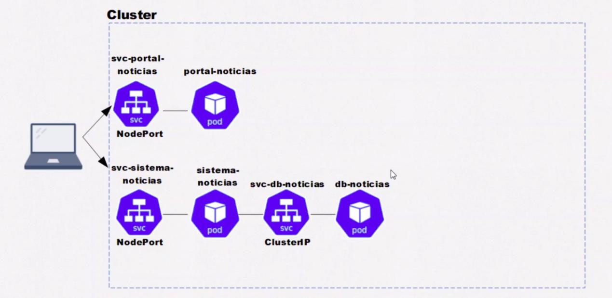

# Descrição

    Projeto para teste de Kubernates, com services, pods e configmap
    
    
# Requisitos:
    Instalar kubectl
    Instalar oracleVM
    Instalar MiniKUbe -> para criar o clusters, precisa ser linkado com o drive de virtualização no caso oracleVM

# Conceitos:

    Pod = Casulo 1 ou mais containers, 1 endereço de IP, efêmero
    Service = Tipo um sidecar do Pod, dando mais poderes ao mesmo.
    ConfigMap = Variaveis (Chave/valor)

# Principais comandos:

## Rodar Aplicação
    kubectl apply -f portal-noticias.yaml
    kubectl apply -f sistema-noticias.yaml 
    kubectl apply -f svc-sistema-noticias.yaml 
    kubectl apply -f svc-portal-noticias.yaml
    e assim por diante em todos os arquivos *.yaml
    
    Frontend:
    http://"node-ip":30000
    
    Backoffice:
    http://192.168.99.100:30001/
    user: admin
    password: admin

## Start MiniKube:
    minikube start driver=virtalbox

## Visualizar nodes:
    kubectl get nodes -o wide

## Pods:
    kubectl get pods -o wide
    kubectl describe pod "name"
    kubectl delete pod "name"
    kubectl exec -it pod-1 -- bash
    kubectl delete pods -- all

## Service:
    kubectl get svc
    kubectl get services
    kubectl delete svc -- all

## ConfigMap:
    kubectl get configmap
    kubectl describe configmap "name"

